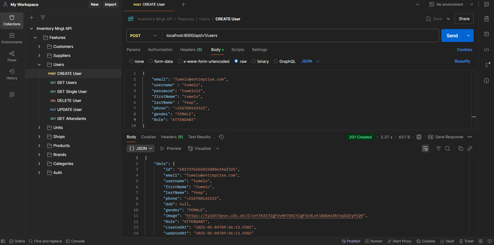
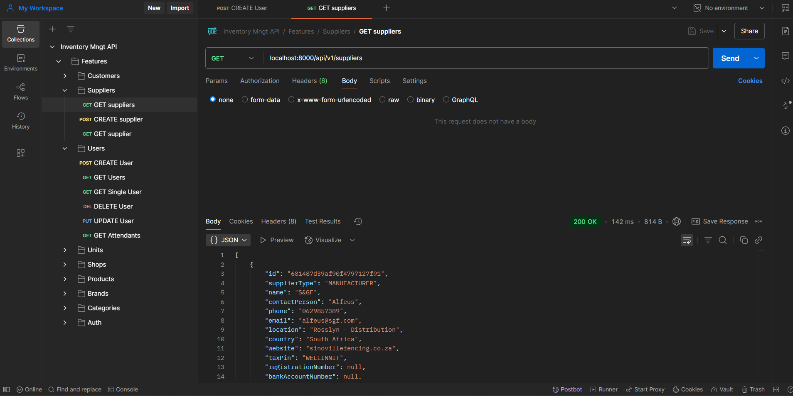

# ✨ Inventory Management API for Point Of Sales (POS) ✨

An advanced shop inventory management api built with `Node.js`, `Typescript`, `prisma`, and `MongoDB` featuring authentication and authorization, shop management, product management, and customer & Sales tracking for overview shop performance. 

The API follows the `MVC pattern` where models are defined in the Prisma schema file, the controllers in the controllers folder and the views in a frontend framework of choice such as Angular or React.

 

## ⚙️ Tech Stack

-   ✨ `Express.Js` framework with Node.Js runtime
-   ✨ `MongoDB` with `Prisma` as ORM
-   ✨ `bcrypt` and `JWT` for encryption
-   ✨ `CORS` enabled
-   

## 🔋 Features 

👉 **Database Modeling**: Using `Prisma` for defining models for `MongoDB`.

👉 **Authentication**: Authentication of users through `jwt`.

👉 **Logging Mechanisms**: For better debugging and monitoring.

## 🕸️ Snippets
🚀🌐🛡️📋➕✏️🔃🚀🛠️👌🌟🛠️

 
    **Create a User**

 

    **Get all suppliers**

